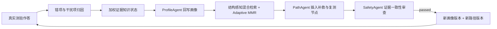

# 评测驱动的多 Agent 补救闭环

## 目标

该创新把原先“查看报告后手动重生成路径”升级为可执行闭环：真实作答进入错因诊断和知识追踪，诊断结果回写画像，RAG 检索补救证据，PathAgent 创建包含复测门槛的新路径，SafetyAgent 通过后再持久化。

## 三个核心创新点

1. 真实作答因果归因：QuizService 按未作答和干扰项语义区分 `recall_gap`、`procedure_substitution`、`boundary_condition_missing`、`causal_reasoning_gap`，薄弱点直接来自答错题目的知识点，杜绝固定演示结论。
2. 评测驱动知识追踪：当前实现以测验正确性与学习行为证据的加权掌握度为准，并在班级洞察中输出证据不足状态；Beta(1,1) 平滑与置信度字段仍属于未来候选，不作为当前已实现能力。
3. 可观察的自动干预：`POST /api/evaluation/intervention` 返回 `task_id`，依次运行 EvaluationAgent、KnowledgeTracingAgent、ProfileAgent、检索与 MMR、PathAgent、ResourcePlannerAgent 和 SafetyAgent。前端显示实时 Agent 与进度，完成后可查看错因可信度、RAG 证据数量和新路径。

## 数据闭环

## 安全与失败策略

- AI 服务必须返回 RAG 证据和结构化 SafetyAgent 结果。
- 无测验记录、当前无需干预、证据不足或 SafetyAgent 未通过时，不写入画像与路径。
- 长任务支持统一查询、SSE 进度、取消和失败重试。

## 验证

- AI：端点测试覆盖诊断方法、平滑掌握度、Agent 顺序、路径复测门槛、检索策略和 SafetyAgent。
- 后端：契约测试覆盖真实错因、画像回写、任务进度、结果持久化和学生数据隔离。
- 前端：类型检查与生产构建覆盖评测闭环、任务进度及学习路径闭环标识。
