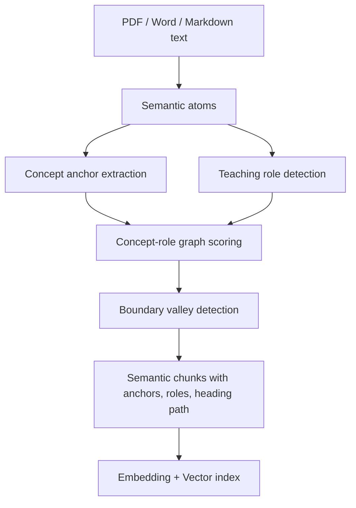

# RAG Advanced Semantic Chunking Design

## Innovation: Concept-Role Graph Semantic Chunking

EduPath no longer chunks uploaded learning documents by fixed character windows.
The AI service now uses a course-aware semantic chunker that models every
document as a graph of pedagogical atoms:

- **Concept anchors**: data-structure, algorithm, and computer-organization terms
  such as `二叉树`, `Dijkstra`, `Cache`, `TLB`, `流水线`, and `复杂度`.
- **Teaching roles**: heading, definition, example, algorithm, code, complexity,
  architecture, equation, and exercise.
- **Structure edges**: sequential order, heading hierarchy continuity, concept
  overlap, and high-value teaching transitions such as definition -> example and
  algorithm -> complexity.

This makes chunk boundaries align with how course knowledge is taught: a
definition and its example are kept together when coherent, while a new heading,
exercise, or low-coherence topic shift starts a new chunk.



## Chunk Metadata

Each `RagChunk` now carries retrieval-oriented metadata:

- `anchors`: concept terms that should influence retrieval.
- `roles`: teaching roles contained in the chunk.
- `heading_path`: local document hierarchy.
- `semantic_signature`: stable signature for traceability and deduplication.
- `prev_chunk_id` / `next_chunk_id`: adjacent chunk links for context expansion.

Both local vector search and Chroma indexing include this metadata in the indexed
text, so uploaded documents become searchable by concept and pedagogical intent,
not only by raw paragraphs.

## Embedding Model

Recommended open-source Hugging Face model:

- `BAAI/bge-m3`

Reasoning:

- Multilingual retrieval, suitable for Chinese course notes mixed with English
  CS terms.
- Strong dense retrieval baseline.
- Long-context friendly compared with many small sentence models.
- Supports future hybrid retrieval upgrades without changing EduPath API
  contracts.

Configuration:

```bash
pip install -e ".[dev,vector,embedding]"
EMBEDDING_PROVIDER=huggingface
EMBEDDING_MODEL=BAAI/bge-m3
VECTOR_STORE_PROVIDER=chroma
uvicorn app.main:app --reload --port 8000
```

For offline demos and tests, `EMBEDDING_PROVIDER=local` keeps deterministic hash
embeddings.

## Authoritative Two-Course Corpus

The competition corpus is built from traceable course documents registered in:

- `ai-service/data/course_corpus/curriculum.yaml`
- `ai-service/data/course_corpus/catalog.yaml`
- `ai-service/data/course_corpus/source_documents/`

The curriculum is aligned with Java knowledge-point IDs and currently defines 24
required coverage points across Data Structures and Algorithms plus Computer
Organization. The builder parses PDF/DOCX/PPTX/text, rejects path traversal and
missing provenance, deduplicates normalized content, and emits both startup JSONL
and an auditable coverage report:

```bash
cd ai-service
python scripts/build_course_corpus.py --strict-coverage
python scripts/evaluate_course_corpus.py --min-hit-rate 0.9 --min-mrr 0.8
```

The initial repository baseline covers 8 of 24 required points with project-authored
demonstration documents. That baseline proves the RAG chain but is not a complete
course knowledge base. Real course material must be added through the catalog until
coverage reaches 100% and the golden retrieval set passes.

## Optional Seed Corpus Supplements

The seed corpus downloader targets two course areas:

| Course | Hugging Face dataset | Intended use |
| --- | --- | --- |
| Data Structures and Algorithms | `codeparrot/apps` | Algorithmic problem statements involving trees, graphs, dynamic programming, and complexity analysis |
| Computer Organization | `HuggingFaceFW/fineweb-edu` | Education-filtered text for cache, pipeline, virtual memory, address translation, and CPU architecture |

Downloader:

```bash
cd ai-service
python scripts/download_hf_seed_corpus.py --max-per-topic 6
```

The script writes:

- `data/seed_corpus/seed_documents.jsonl`
- `data/seed_corpus/hf_seed_manifest.json`
- `data/seed_corpus/README.md`

`DocumentLoader` automatically loads `seed_documents.jsonl` when it exists. The
current repository includes only a sample JSONL and a manifest because this
environment timed out when connecting to Hugging Face; the sample file is not
auto-loaded. These datasets may supplement examples, but their topic filtering,
educational quality, license, and curriculum alignment must be reviewed before
they enter the authoritative corpus.

## Evaluation Checklist

- Uploaded PDF/Word text creates multiple semantic chunks when topic or role
  boundaries exist.
- Querying a concept anchor retrieves the matching chunk even if the exact title
  does not contain the query.
- Chroma metadata contains anchors, roles, heading path, signature, and adjacent
  chunk ids.
- Offline tests pass with local embeddings.
- Production retrieval can switch to `BAAI/bge-m3` by changing environment
  variables and installing the `embedding` extra.
- Multiple documents under the same knowledge point retain distinct chunk IDs.
- `coverage_report.json` reaches 100% required-point coverage with no errors.
- Golden retrieval evaluation meets the agreed Hit@K and MRR thresholds.
